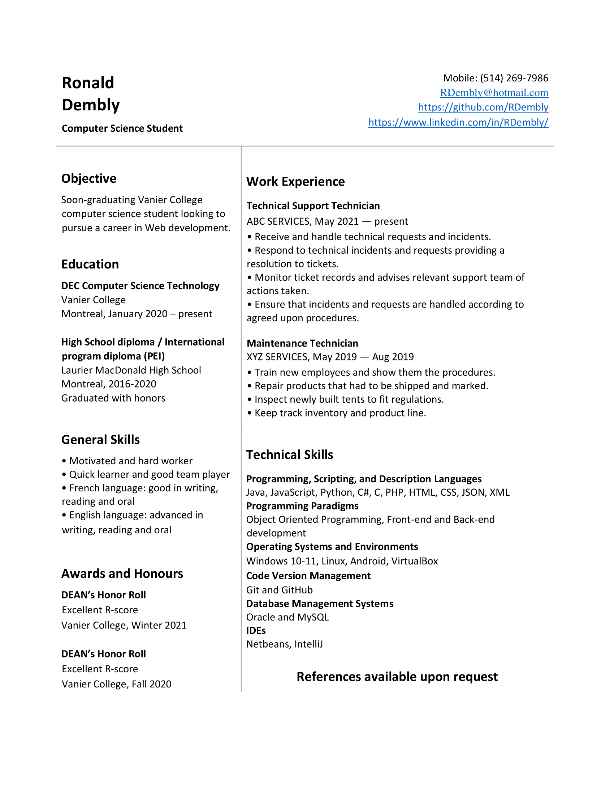

# Guidelines for Writing your Resume

When writing a resume, there is information that you need to include to identify the resume to you, and to list the credentials, skills, and experiences that you have and that match the career objectives that you are trying to realise. These guidelines are especially directed toward Computer Science students.

# Header

The header section identifies you. Include the following information:

- Name
- Phone Number
- Email Address
- GitHub URL (strongly recommended): provide them with a portfolio of your accomplishments. Take the opportunity to ensure that you are proud of your public repositories and how they represent you.
- LinkedIn URL (optional): This is your online CV, in its extended version. Use this to get exposure.

# Objective

This section is a small cover letter. Explain here what your immediate career goal is. This is particularly useful if you are looking for a career job or if you are applying for a specific internship position in a certain company. Sometimes there is more than one position available in a company or organization, and employers often like to know exactly what job you are applying for in your resume as well as in your cover letter.

# Technical Skills

Point-form listing of the skills you think are relevant to a particular internship/job. This section will need to be customized to the type of internship/job that you are trying to get.

# General Skills

These are nontechnical skills that the prospective employer might be looking for, such as languages you speak and write (especially English and French), and more personal skills like being motivated, responsible, being a hard worker, a fast learner, and being able to work well with others.

# Work Experience

Jobs are listed in **reverse chronological orde** r (most recent first).

All work experience could be included, however work experience related to your Computer Science internship should be highlighted. You may include volunteer work if you want.

For each work experience entry, include the following: Job Title, Name of Company, Dates (month/year - month/year), Job Description, in point form.

# Education

Education is always listed in **reverse chronological order**. If you have not yet completed a diploma, but are on your way to completing this diploma, list it and include the note: "degree pending" or any note that accurately describes its completion state.

For each education entry, include the following: Degree earned, Institution, Location, Year obtained or "year/month started – present".

Location can be written as anything unambiguous: sometimes, only the city is required, sometimes, the country is required as well.

# Awards and Honours (optional)

List awards or honours that you may have received, at school or elsewhere (not work), if you think that they are relevant to the job you are seeking. Academic and related awards/honours should always be included, whereas things like bowling awards may not be included (unless relevant to the job).

**For each award entry, include the following: Award/honour name,** Description (optional), Granting institution, Date (year).

Work-related honours, e.g., salesperson of the year for 2021 to 2023, should be listed under the linked work experience entry in the work experience category.

# Interests (optional)

If your resume is empty, or if this will not cause the CV to be crowded, or otherwise if the application instructions state that you should or you are certain it will help to talk about your special interests for this job/employer, then you can include a section about your personal interests. Otherwise, if it will make your CV crowded, you should think about skipping this section.

# Keywords

Employers use software that search for words in documents in order to find the most relevant CVs and cover letters. Specifically, employers are searching for keywords in these documents to get the candidates that match the job postings as much as possible.

When you create your application as a response to a job posting, you should make sure that kyour CV/cover letter speak the same language as the job posting. In other words, adapt the language in your CV to correctly contain the keywords that are used in the requirements expressed in the job posting.

For example, if you have experience with MySQL, PostgreSQL, and Oracle and write `Relational Database Management Systems` in your CV, but the job posting asks for experience with PostgreSQL, then you must make sure to include the term PortgreSQL in your CV in the technical skills section.

# Styling 

Use a professional style for your resume that does not contain too many colors and fonts. Visit canva.com to get inspired about which template you can use. 

# THE DO'S AND DON'TS

## DO

- Do keep it **short** : one, or at the most, two pages. If you do not have multiple relevant employment, or relevant projects, there is no reason your resume should be longer than one page.
- Do keep it **consistent**. Use the same font and size throughout.
- Do **mind print quality** if giving hard copies of your CV to employers.
- Do use **reverse chronological order** : for employment, list your most recent or present job first; for education, list the most recent school you attended or the school you are currently attending, and continue in reverse chronological order.
- Do **identify your CV** with your name, telephone number and email address in the page header, where the reader will notice it.
- Do **visibly number pages if your résumé has two or more pages**. For example, make sure your name, and the page number "2" is at the top of the second page, e.g.: John Smith 2/2 ("2/2" means that this is the second of two pages).
- Do use **strong, action verbs** instead of weak, passive verbs. For example, instead of stating, "I was given responsibility of looking after children in an after-school program," state "I supervised children in an after-school program."
- Do **use implied pronouns** (understood by the reader although they are not stated) all the time. For example, instead of listing as a skill, "I am proficient in three languages," simply put down, "proficient in three languages."
- Do **include your summer and/or part-time jobs** if you are in still in school. Jobs such as waiting on tables, staffing a cash register, or babysitting, which may have nothing to do with their career goals, show that you have had work experience and that you are able and willing to work.
- Do **include a cover letter** with your résumé which is custom-made for each individual application.
- Do have someone else **proof-read** your résumé and cover letter for spelling, grammar, and syntax errors, and to tell you if the résumé has visual appeal.
- Do **follow up** on your application by calling soon after to ask whether a decision has been made and/or if you can come in for an interview. Use your judgement, however: do not call the day after you have sent in your résumé (normally five days to a week is sufficient), never call more than twice, and never ever call if you have been told not to (this is usually specified in the ads for the job in question).

## DON'T

- Don't use too many different formats, styles, or fonts in your résumé. More than two fonts or styles looks busy and can distract the reader from the actual information.
- Don't squeeze everything together on the page just to make it all fit. Readers like clusters of information with clean spaces between them and may not read something which looks crowded.
- Don't list information which is not relevant to the kind of position you are seeking. For example, the fact that you like going to movies in your spare time is only relevant if you are applying for a job as a movie critic; otherwise, leave it out.
- Don't provide information which you by law do not have to provide, like your age, your weight, your measurements, your marital status, your photograph, your present or past salary or whether you are physically or mentally challenged.
- Don't provide information about your former employers or other referees, such as their names, addresses, or telephone numbers. Ask past employers or people who you wish to use as references first before giving out any information about them, and then only provide this information if it is specifically requested.
- Don't ever, under any circumstance, include your Social Insurance number.
- Don't provide the name and telephone number of your present employer if he or she does not know that you are seeking other employment! (Amazingly, applicants make this mistake all the time).
- Don't include an explanation of why you left your past employment: it is unnecessary and, often, will lose you the job for which you are applying.
- Don't use too many big words to say what you mean. Most of us--including employers-- prefer straightforward and concise descriptions over loquacious and grandiloquent (wordy) ones!
- Don't use complete sentences.
- Don't think that your résumé alone will get you in the door! Always try to arrange for an interview, because that is where you can make a real impression on a prospective employer. (See handout on job interviews for more information)

